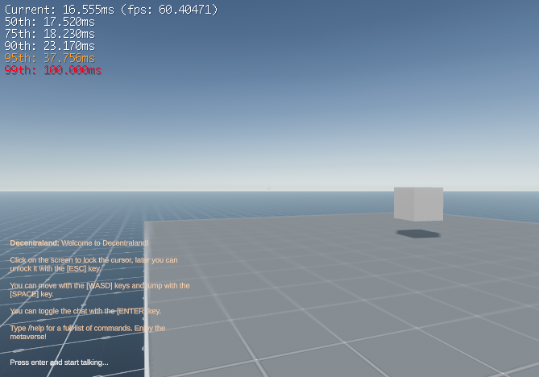

# 00: Setup

Primary resource --> https://docs.decentraland.org/

Install NodeJS

```
npm init
npm i decentraland-ecs decentraland
npx dcl init
```

Then run:

```
npm run start
```

to see the "game" running in your browser.  If you have Metamask installed it will prompt you to connect before the page finishes loading (but it also works without metamask).

It should look something like this:



Frame rate for debugging in top left

Chat in bottom left.  It actually works when players are connected to the same server.  Try it by using a second tab.

A spinning box in the scene

You can walk (wasd or arrows) around and jump (space).

once you `npm run start` you open a second command prompt and run `npm run watch`.  Then anytime you make a change it will recompile and you simply refresh the browser to see your updates

delete the example contents inside `game.ts` (done in playground)

Add a model:

Add this to `game.ts` (this is the entire file ATM)

```
const scene = new Entity()
scene.addComponent(new GLTFShape("models/scene.glb"))
scene.addComponent(new Transform({rotation: Quaternion.Euler(0,180,0)}))
engine.addEntity(scene)
```